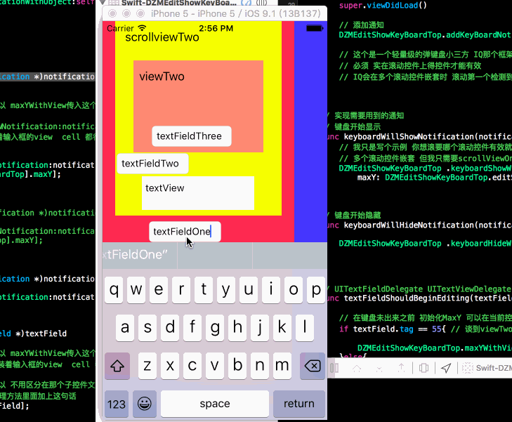
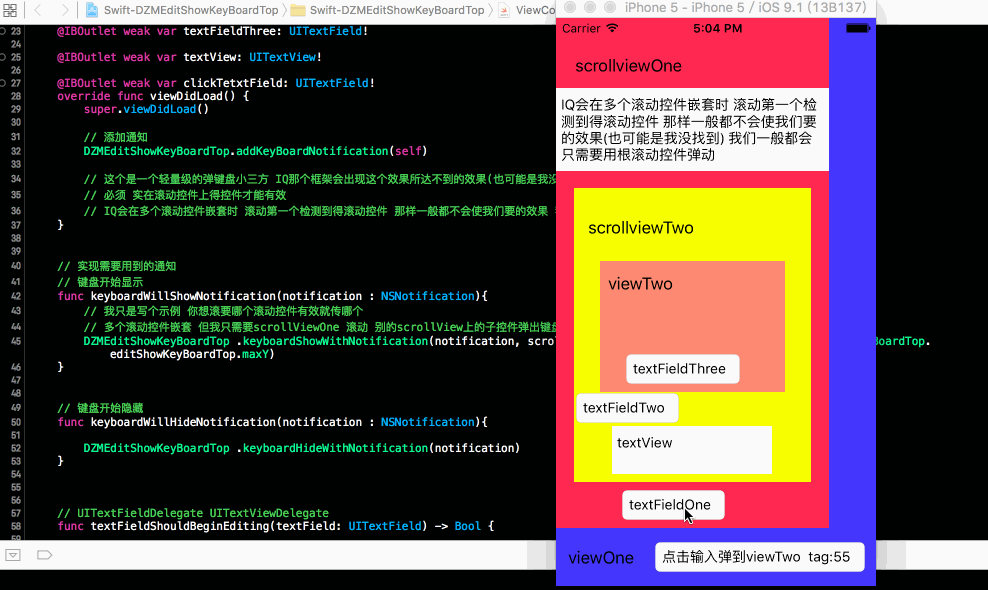

# Swift-DZMEditShowKeyBoardTop
介绍:将一个文本框或者一个空间弹动到键盘之上 本框架比IQKeyboardManager(简写IQ) 有一个优势 当多个滚动控件嵌套时 IQ会滚动它检测到的第一个滚动控件 但是DZMEditShowKeyBoardTop不会 你可以任意选择你需要支持弹动滚动控件 ScollView TbaleView CollectionView 能滚动即可 实现简单 可以任意修改或者自行添加runtime机制 注释明确

#pragma mark -- OC版本 OC-DZMEditShowKeyBoardTop
 https://github.com/dengzemiao/OC-DZMEditShowKeyBoardTop

##实现代码
override func viewDidLoad() {
super.viewDidLoad()

// 添加通知
DZMEditShowKeyBoardTop.addKeyBoardNotification(self)

// 这个是一个轻量级的弹键盘小三方 IQ那个框架会出现这个效果所达不到的效果(也可能是我没找到)
// 必须 实在滚动控件上得控件才能有效
// IQ会在多个滚动控件嵌套时 滚动第一个检测到得滚动控件 那样一般都不会使我们要的效果 我们一般都会只需要用根滚动控件弹动
}

// 实现需要用到的通知
// 键盘开始显示
func keyboardWillShowNotification(notification : NSNotification){
// 我只是写个示例 你想滚要哪个滚动控件有效就传哪个
// 多个滚动控件嵌套 但我只需要scrollViewOne 滚动 别的scrollView上的子控件弹出键盘也只需要滚动scrollViewOne
DZMEditShowKeyBoardTop .keyboardShowWithNotification(notification, scrollView: self.scrollViewOne, maxY: DZMEditShowKeyBoardTop.editShowKeyBoardTop.maxY)
}

// 键盘开始隐藏
func keyboardWillHideNotification(notification : NSNotification){

DZMEditShowKeyBoardTop .keyboardHideWithNotification(notification)
}

--------------------------------------------------------------------------------------------------------------

##代码图片

--------------------------------------------------------------------------------------------------------------

##期待
* 如果在使用过程中遇到BUG，希望你能Issues我，谢谢!
* 如果在使用过程中发现功能不够用，希望你能Issues我.